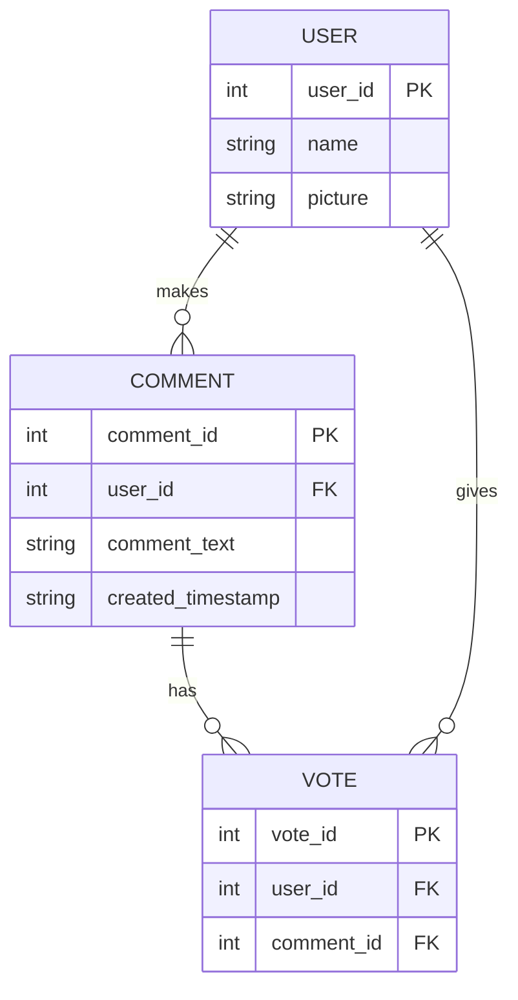

# ouija-board-enigma

## Setup

Create `.env` file in the root of the project. Add values for the following variables.

```text
MYSQL_DB_ROOT_USER=<string>
MYSQL_DB_ROOT_PASSWORD=<string>
MYSQL_DB_DATABASE=<string>
MYSQL_DB_LOCAL_PORT=<number>
MYSQL_DB_DOCKER_PORT=<number>
NODE_LOCAL_PORT=<number>
NODE_DOCKER_PORT=<number>
```

Run `docker-compose up` to build the docker containers and start the service.

## Routes

`GET     /comments`  
`POST    /comments`  
`GET     /users`
`GET     /users/{id}`  
`POST    /users`  
`GET     /votes`  
`DELETE  /votes/users/{userId}/comments/{commentId}`  
`PUT     /votes/users/{userId}/comments/{commentId}`  

## ER Diagram


