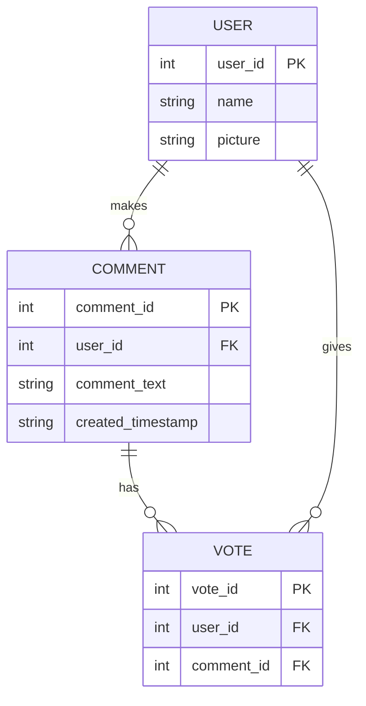

# ouija-board-enigma

## Routes

`GET     /comments`  
`POST    /comments`  
`GET     /users`
`GET     /users/{id}`  
`POST    /users`  
`GET     /votes`  
`DELETE  /votes/users/{userId}/comments/{commentId}`  
`PUT     /votes/users/{userId}/comments/{commentId}`  

## ER Diagram

